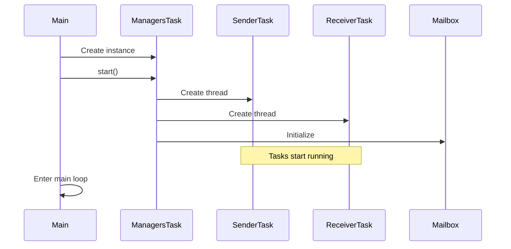
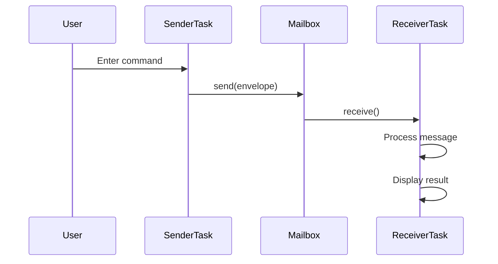
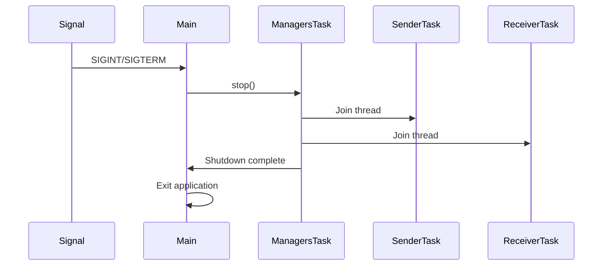

# iCamera Architecture Documentation

## Overview

iCamera is a modular camera system designed for embedded applications, featuring a multi-threaded architecture with task management, inter-process communication via mailbox, and support for various hardware modules (audio, video, network).

## System Architecture

### High-Level Design

```
┌─────────────────────────────────────────────────────────────┐
│                        iCamera System                       │
├─────────────────────────────────────────────────────────────┤
│  Main Application (main.cpp)                                │
│  ├── Signal Handlers                                        │
│  ├── Global Shutdown Management                             │
│  └── Application Lifecycle                                  │
├─────────────────────────────────────────────────────────────┤
│  Task Management Layer (ManagersTask)                       │
│  ├── Task Scheduler                                         │
│  ├── Thread Management                                      │
│  ├── Graceful Shutdown Control                              │
│  └── Task Lifecycle Management                              │
├─────────────────────────────────────────────────────────────┤
│  Communication Layer (Mailbox System)                       │
│  ├── Message Queue                                          │
│  ├── Inter-Task Communication                               │
│  ├── Event Handling                                         │
│  └── Message Routing                                        │
├─────────────────────────────────────────────────────────────┤
│  Application Tasks                                          │
│  ├── Sender Task (User Input)                               │
│  ├── Receiver Task (Message Processing)                     │
│  ├── Audio Task (Audio Processing)                          │
│  ├── Video Task (Video Processing)                          │
│  ├── MQTT Task (Network Communication)                      │
│  └── Managers Task (System Management)                      │
├─────────────────────────────────────────────────────────────┤
│  Hardware Abstraction Layer                                 │
│  ├── Audio Manager                                          │
│  ├── Video Manager                                          │
│  ├── Network Manager                                        │
│  └── Device Drivers                                         │
└─────────────────────────────────────────────────────────────┘
```

## Core Components

### 1. Task Management System

#### ManagersTask Class
- **Purpose**: Central task coordinator and thread manager
- **Responsibilities**:
  - Task lifecycle management
  - Thread creation and cleanup
  - Graceful shutdown coordination
  - Task status monitoring

#### Task Structure
```cpp
struct TaskEntry {
    std::string name;           // Task identifier
    std::function<void()> func; // Task function pointer
    std::thread thread;         // Associated thread
};
```

#### Task Registration
```cpp
// In ManagersTask constructor
tasks.push_back({"Sender", task_sender});
tasks.push_back({"Receiver", task_receiver});
// Future tasks can be added here
```

### 2. Communication System

#### Mailbox Architecture
- **Global Mailbox**: `AIOTEK::g_mailbox`
- **Message Types**: SignalEvent, ErrorEvent, CustomEvent, String, Int
- **Thread-Safe**: Uses mutex and condition variables

#### Message Flow
```
Sender Task → Mailbox → Receiver Task
     ↓           ↓           ↓
User Input → Message Queue → Processing
```

#### Message Structure
```cpp
struct MailboxEnvelope {
    TaskID sender;        // Source task
    TaskID receiver;      // Destination task
    MailboxMessage payload; // Message content
};
```

### 3. Task Components

#### Sender Task
- **Purpose**: Handle user input and command processing
- **Commands**:
  - `msg <text>`: Send text message
  - `signal <num>`: Send signal event
  - `event <name> <payload>`: Send custom event
  - `quit`: Initiate shutdown

#### Receiver Task
- **Purpose**: Process incoming messages and events
- **Capabilities**:
  - Message type detection and routing
  - Event handling
  - Shutdown signal processing

## Sequence Diagrams

### System Startup Sequence



### Message Communication Sequence



### Graceful Shutdown Sequence



## Thread Management

### Thread Lifecycle
1. **Creation**: Threads created in `ManagersTask::start()`
2. **Execution**: Each task runs in its own thread
3. **Synchronization**: Mailbox provides thread-safe communication
4. **Cleanup**: Threads joined in `ManagersTask::stop()`

### Thread Safety
- **Mailbox**: Protected by mutex and condition variables
- **Global Variables**: Volatile flags for shutdown coordination
- **Resource Management**: RAII pattern for automatic cleanup

## Error Handling

### Exception Safety
- **RAII**: Automatic resource cleanup
- **Graceful Degradation**: Tasks can fail independently
- **Error Propagation**: Error events through mailbox system

### Shutdown Handling
- **Signal Handling**: SIGINT/SIGTERM processing
- **Graceful Exit**: Proper thread cleanup
- **Resource Cleanup**: Automatic destructor calls

## Configuration Management

### Build Configuration
- **Native Build**: Development environment
- **Cross-Compilation**: ARM target support
- **Debug/Release**: Different optimization levels

### Runtime Configuration
- **Task Parameters**: Configurable via ManagersTask
- **Hardware Settings**: Device-specific configurations
- **Network Settings**: MQTT broker configuration

## Extensibility

### Adding New Tasks
1. Define task function
2. Add to ManagersTask constructor
3. Implement message handling if needed
4. Update documentation

### Adding New Message Types
1. Extend MailboxMessage variant
2. Update message processing logic
3. Add serialization if needed

### Hardware Module Integration
1. Implement device manager
2. Create task wrapper
3. Add to task list
4. Configure device parameters

## Performance Considerations

### Memory Management
- **Smart Pointers**: Automatic memory management
- **Move Semantics**: Efficient resource transfer
- **Memory Pools**: For frequent allocations

### Thread Efficiency
- **Condition Variables**: Efficient thread synchronization
- **Lock-Free Communication**: Where possible
- **Minimal Blocking**: Non-blocking operations preferred

## Security Considerations

### Input Validation
- **Command Parsing**: Validate user input
- **Message Validation**: Check message integrity
- **Resource Limits**: Prevent resource exhaustion

### Network Security
- **MQTT Security**: TLS/SSL support
- **Authentication**: User credentials
- **Access Control**: Topic-based permissions

## Testing Strategy

### Unit Testing
- **Task Isolation**: Test individual tasks
- **Message Handling**: Test mailbox operations
- **Error Conditions**: Test exception handling

### Integration Testing
- **Task Communication**: Test inter-task messaging
- **System Startup**: Test complete initialization
- **Shutdown Process**: Test graceful termination

### Performance Testing
- **Throughput**: Message processing rate
- **Latency**: Response time measurements
- **Resource Usage**: Memory and CPU monitoring

## Deployment

### Build Process
```bash
./scripts/build_project.sh [native|cross]
```

### Installation
```bash
./scripts/build_project.sh install
```

### Runtime
```bash
./build/bin/iCamera
```

## Future Enhancements

### Planned Features
- **Plugin System**: Dynamic task loading
- **Configuration UI**: Web-based configuration
- **Logging System**: Structured logging
- **Metrics Collection**: Performance monitoring

### Scalability Improvements
- **Load Balancing**: Task distribution
- **Clustering**: Multi-node support
- **High Availability**: Fault tolerance

---

*This documentation is maintained as part of the iCamera project. For questions or contributions, please refer to the project repository.* 